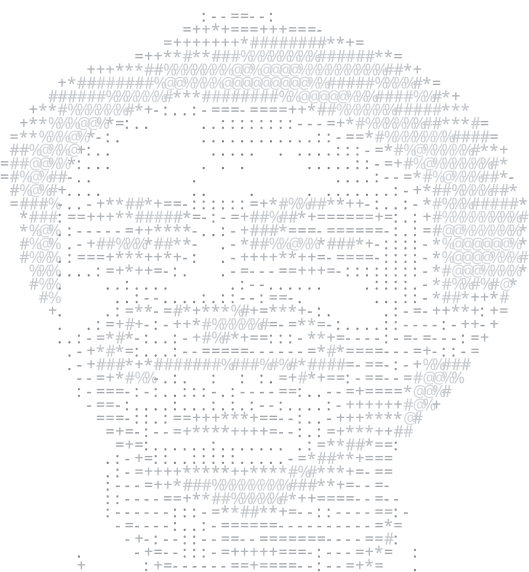

 

<h3>
  &emsp;&emsp;&emsp;&emsp;<samp>│</samp>&emsp;<a href="https://github.com/DaviBonetto">davi@github</a>
</h3>

&emsp;&emsp;&emsp;&emsp;<samp>│</samp>&emsp;<samp>──────────────────────────────────────</samp> 
&emsp;&emsp;&emsp;&emsp;<samp>│</samp> 
&emsp;&emsp;&emsp;&emsp;<samp>│</samp>&emsp;<code>field&nbsp;&nbsp;&nbsp;</code>&nbsp;&nbsp;machine learning 
&emsp;&emsp;&emsp;&emsp;<samp>│</samp>&emsp;<code>focus&nbsp;&nbsp;&nbsp;</code>&nbsp;&nbsp;robust AI systems 
&emsp;&emsp;&emsp;&emsp;<samp>│</samp>&emsp;<code>research</code>&nbsp;&nbsp;state-space models 
&emsp;&emsp;&emsp;&emsp;<samp>│</samp>&emsp;<code>systems&nbsp;</code>&nbsp;&nbsp;agents / robotics 
&emsp;&emsp;&emsp;&emsp;<samp>│</samp>&emsp;<code>code&nbsp;&nbsp;&nbsp;&nbsp;</code>&nbsp;&nbsp;python / rust / c++ / ts 
&emsp;&emsp;&emsp;&emsp;<samp>│</samp>&emsp;<code>location</code>&nbsp;&nbsp;brazil 
&emsp;&emsp;&emsp;&emsp;<samp>│</samp>&emsp;<code>status&nbsp;&nbsp;</code>&nbsp;&nbsp;researcher / builder 
&emsp;&emsp;&emsp;&emsp;<samp>│</samp>&emsp;<code>web&nbsp;&nbsp;&nbsp;&nbsp;&nbsp;</code>&nbsp;&nbsp;coming soon

 

  <a href="https://www.linkedin.com/in/davi-bonetto-a4a795350/">linkedin</a>
  &nbsp;&nbsp;·&nbsp;&nbsp;
  <a href="https://x.com/DaviB73098">x</a>
  &nbsp;&nbsp;·&nbsp;&nbsp;
  <a href="mailto:davi.bonetto100@gmail.com">email</a>
  &nbsp;&nbsp;·&nbsp;&nbsp;
  website — coming soon

