<div align="center">

```text
██████╗  █████╗ ██╗   ██╗██╗    ██████╗  ██████╗ ███╗   ██╗███████╗████████╗████████╗ ██████╗
██╔══██╗██╔══██╗██║   ██║██║    ██╔══██╗██╔═══██╗████╗  ██║██╔════╝╚══██╔══╝╚══██╔══╝██╔═══██╗
██║  ██║███████║██║   ██║██║    ██████╔╝██║   ██║██╔██╗ ██║█████╗     ██║      ██║   ██║   ██║
██║  ██║██╔══██║╚██╗ ██╔╝██║    ██╔══██╗██║   ██║██║╚██╗██║██╔══╝     ██║      ██║   ██║   ██║
██████╔╝██║  ██║ ╚████╔╝ ██║    ██████╔╝╚██████╔╝██║ ╚████║███████╗   ██║      ██║   ╚██████╔╝
╚═════╝ ╚═╝  ╚═╝  ╚═══╝  ╚═╝    ╚═════╝  ╚═════╝ ╚═╝  ╚═══╝╚══════╝   ╚═╝      ╚═╝    ╚═════╝
```

### AI Engineer | Researcher | Open Source Builder

<p align="center">
  <a href="https://www.linkedin.com/in/davi-bonetto-a4a795350/">
    
  </a>
  <a href="https://x.com/DaviB73098">
    
  </a>
  <a href="https://github.com/DaviBonetto">
    
  </a>
  <a href="mailto:davi.bonetto100@gmail.com">
    
  </a>
</p>

</div>

---

## 👨‍💻 About Me

I am an **AI Engineer and Researcher** focused on building intelligent systems from first principles. My work revolves around the intersection of cognitive architectures, autonomous agents, and high-performance computing. I am driven by the goal of creating software that mimics human reasoning and scalability.

I build in public, contribute to open source, and continuously study advanced topics in Computer Science and Artificial Intelligence.

---

## 🧠 System Architecture Strategy

My engineering philosophy is organized into a 5-layer cognitive stack, designed to separate concerns from sensory perception to immutable settlement.


---

## 🛠️ Technical Arsenal

<table border="0" width="100%">
<tr>
<td width="55%" valign="top">

### **Core & Compute**


### **Intelligence & ML**


### **Data & Backend**


### **Interface & Web**


</td>
<td width="45%" valign="top">

### ⚡ Activity Pulse


<br>

<br>


</td>
</tr>
</table>

---

## 🧬 Engineering Methodology

```mermaid
graph TD
    subgraph S1 [The Spectral Engine]
    P(⚡ Complex Signal) -->|Deconstruction| D{💎 First Principles}
    D -->|Architect| A[🏗️ L1-L5 Stack]
    A -->|Implement| S[🚀 Scalable Production]
    S -->|Telemetry| P
    end
    style S1 fill:#0D1117,stroke:#30363d,stroke-width:1px
    style P fill:#0D1117,stroke:#A371F7,stroke-width:2px,color:#fff
    style D fill:#0D1117,stroke:#00D4FF,stroke-width:2px,color:#fff
    style A fill:#0D1117,stroke:#0A66C2,stroke-width:2px,color:#fff
    style S fill:#0D1117,stroke:#2EA043,stroke-width:2px,color:#fff
```



### **The Spectral Approach**

I decompose intelligence into "fundamental frequencies" isolating core constraints (First Principles) before writing a single line of code. This ensures every system I build is grounded in physics and logic, not just hype. **I don't just glue APIs; I architect vertically integrated systems.**

From the low-level settlement layers (**L1**) and compute transport (**L2**) up to agentic cognition (**L4**) and sensory perception (**L5**), I engineer for reliability and scale. My code is the bridge between high-dimensional theory and low-latency production.

> _"True innovation sits at the edge of theory and production. My goal is to compress the timeline between 'reading a paper' and 'shipping a feature,' delivering rigorous AI systems that survive user contact."_

---

## 🌩️ Engineering Metrics

<div align="left">
  
  &nbsp; &nbsp; &nbsp; &nbsp; &nbsp; &nbsp;
  
  &nbsp; &nbsp; &nbsp; &nbsp; &nbsp; &nbsp;
  
</div>

---

<div align="center">
    <i>"The best way to predict the future is to invent it."</i><br>
    <b>- Alan Kay</b>
    <br><br>
    <a href="https://github.com/DaviBonetto">
        
    </a>
</div>
