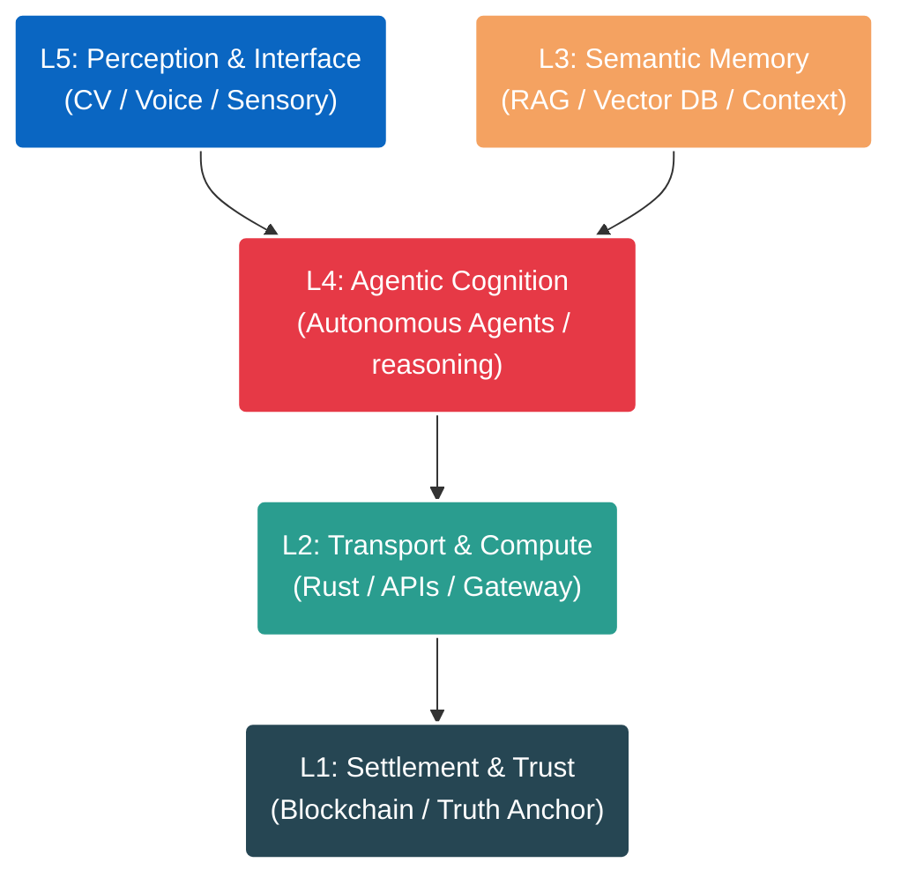

<div align="center">

```text
██████╗  █████╗ ██╗   ██╗██╗    ██████╗  ██████╗ ███╗   ██╗███████╗████████╗████████╗ ██████╗
██╔══██╗██╔══██╗██║   ██║██║    ██╔══██╗██╔═══██╗████╗  ██║██╔════╝╚══██╔══╝╚══██╔══╝██╔═══██╗
██║  ██║███████║██║   ██║██║    ██████╔╝██║   ██║██╔██╗ ██║█████╗     ██║      ██║   ██║   ██║
██║  ██║██╔══██║╚██╗ ██╔╝██║    ██╔══██╗██║   ██║██║╚██╗██║██╔══╝     ██║      ██║   ██║   ██║
██████╔╝██║  ██║ ╚████╔╝ ██║    ██████╔╝╚██████╔╝██║ ╚████║███████╗   ██║      ██║   ╚██████╔╝
╚═════╝ ╚═╝  ╚═╝  ╚═══╝  ╚═╝    ╚═════╝  ╚═════╝ ╚═╝  ╚═══╝╚══════╝   ╚═╝      ╚═╝    ╚═════╝
```

### AI Engineer | Researcher | Open Source Builder

<p align="center">
  <a href="https://www.linkedin.com/in/davi-bonetto-a4a795350/">
    
  </a>
  <a href="https://x.com/DaviB73098">
    
  </a>
  <a href="https://github.com/DaviBonetto">
    
  </a>
  <a href="mailto:davi.bonetto100@gmail.com">
    
  </a>
</p>

</div>

---

## 👨‍💻 About Me

I am an **AI Engineer and Researcher** focused on building intelligent systems from first principles. My work revolves around the intersection of cognitive architectures, autonomous agents, and high-performance computing. I am driven by the goal of creating software that mimics human reasoning and scalability.

I build in public, contribute to open source, and continuously study advanced topics in Computer Science and Artificial Intelligence.

---

## 🧠 System Architecture Strategy

My engineering philosophy is organized into a 5-layer cognitive stack, designed to separate concerns from sensory perception to immutable settlement.



---

## 🛠️ Technical Arsenal

### **Core & Compute**


### **Intelligence & ML**


### **Data & Backend**


### **Interface & Web**


---

## 🎯 Strategic Goals (2026)

| Focus Area      | Objective                                 | Status         |
| :-------------- | :---------------------------------------- | :------------- |
| **Engineering** | Code Every Single Day (Shipping Habit)    | 🟢 Active      |
| **Open Source** | Contribute to High-Impact AI Repositories | 🟡 In Progress |
| **Research**    | Implement SOTA Papers from Scratch        | 🟢 Active      |
| **Community**   | Build & Share Learning in Public          | 🟢 Active      |

---

## 📚 Academic Roadmap

I am pursuing a self-directed, rigorous computer science curriculum based on Stanford graduate materials.

- **Machine Learning**: CS229 (Supervised/Unsupervised), CS221 (AI Principles)
- **Deep Learning**: CS230 (Deep Learning), CS231n (Computer Vision)
- **NLP & Reasoning**: CS224N (NLP w/ Deep Learning), CS336 (LLM Systems)
- **Reinforcement Learning**: CS234

---

## 🌩️ Engineering Metrics

<div align="left">
  
  
</div>

---

<div align="center">
    <i>"The best way to predict the future is to invent it."</i><br>
    <b>- Alan Kay</b>
    <br><br>
    <a href="https://github.com/DaviBonetto">
        
    </a>
</div>
